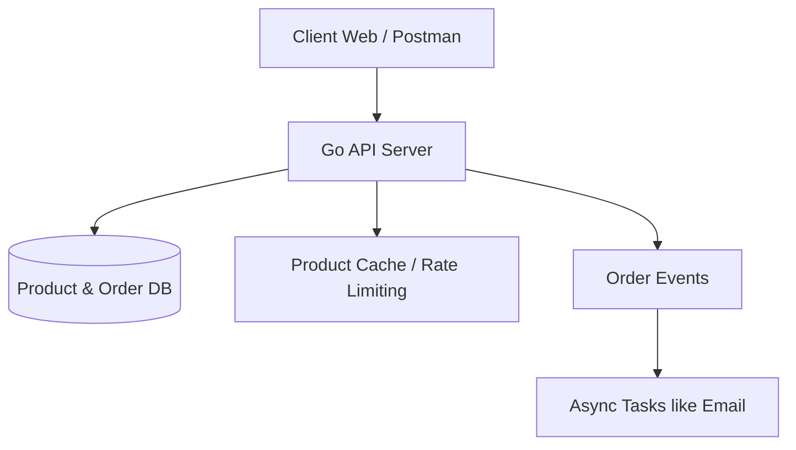

# Go mall

## Introduction

This is a project to demonstrate the familiarity of Go, Redis, and Rabbit MQ. It will be an MVP for now. Future enhancement is on way...

## Tech stack

| Layer                       | Technology                                                                                  |
| --------------------------- | ------------------------------------------------------------------------------------------- |
| **Language**                | Go (1.21)                                                                                   |
| **Framework**               | [Gin](https://github.com/gin-gonic/gin)                                                     |
| **Database**                | PostgreSQL                                                                                  |
| **Cache**                   | Redis                                                                                       |
| **Message Queue**           | RabbitMQ                                                                                    |
| **Testing**                 | [Testify](https://github.com/stretchr/testify), [Vegeta](https://github.com/tsenart/vegeta) |
| **DevOps**                  | Docker, Docker Compose                                                                      |
| **Monitoring** _(Optional)_ | Prometheus + Grafana                                                                        |

## 🗂️ System Architecture (MVP)

## Tasks
👉 [View Task Board (TASKS.md)](./Tasks.md)